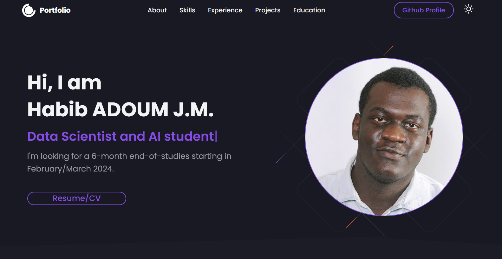
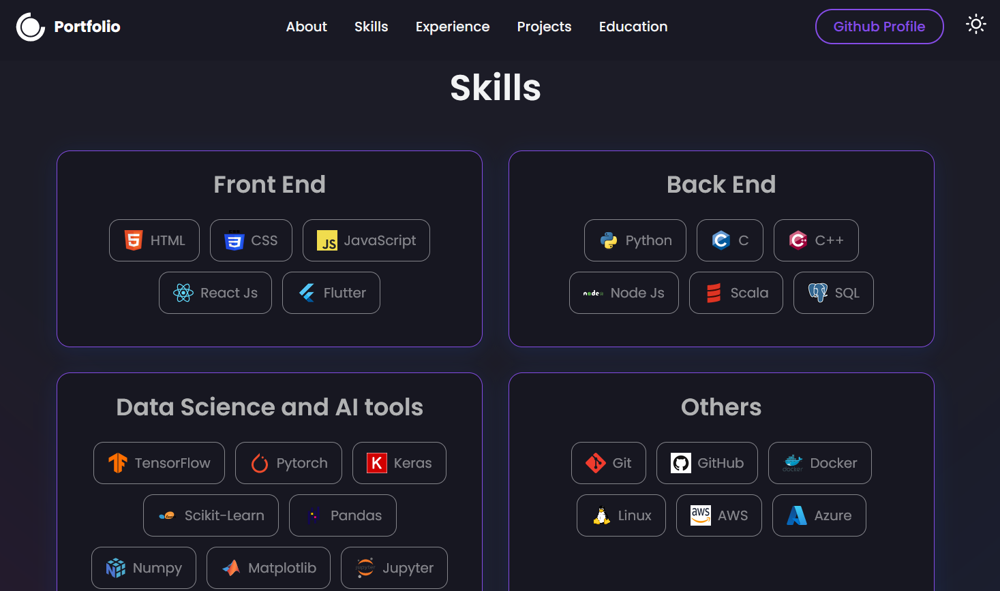
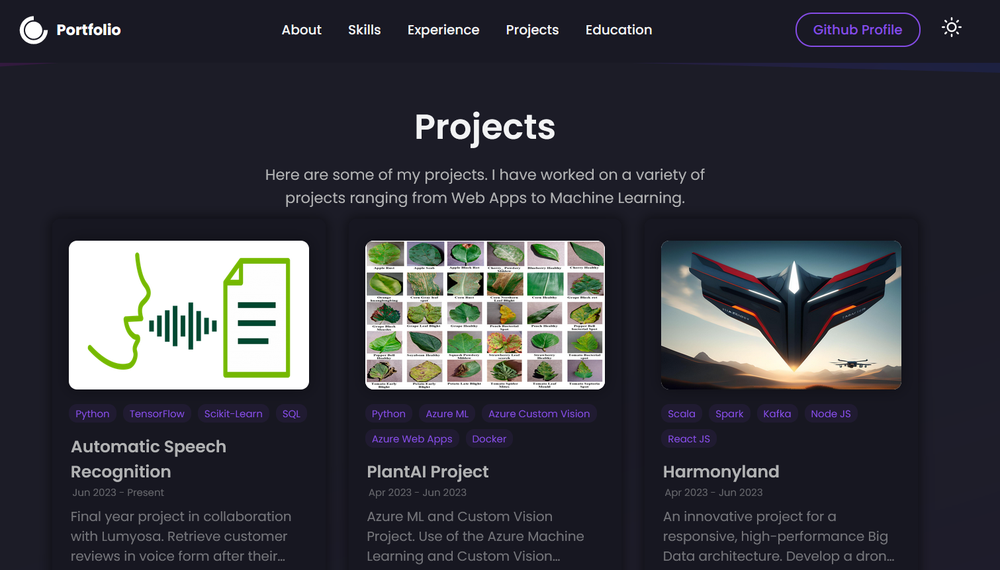
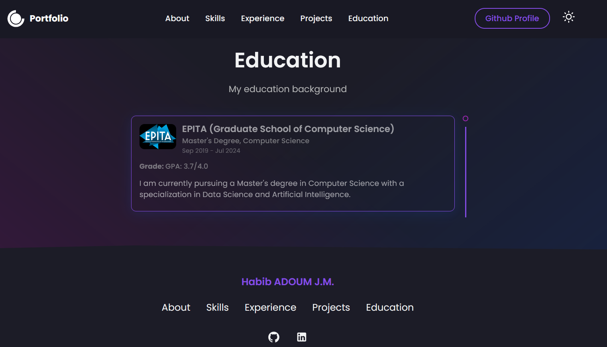

# My Portfolio
Welcome to my portfolio! This project showcases my skills, projects, and experiences as a web developer.

### Weblink: [Live Website](https://ghostdragon01.github.io/portfolio/)
## Some Images:

## Table of Contents
- [Introduction](#introduction)
- [Features](#features)
- [Technologies Used](#technologies-used)
- [Installation](#installation)
- [Usage](#usage)
- [Contributing](#contributing)
- [License](#license)

## Introduction
This project is a portfolio website that showcases my skills, projects, and experiences.

## Features
- About Me: An overview of my background, skills, and experiences.
- Projects: A collection of my notable projects with descriptions, screenshots, and links.
- Skills: A list of my technical skills and proficiencies.
- Resume: A link to download my resume.

## Technologies Used
- **React.js**
- **HTML5 & CSS3**
- **JavaScript**
- **Style-Components**
- **GitHub Pages**

## Installation
To run this portfolio locally, follow these steps:

1. Clone the repository: `git clone https://github.com/ghostdragon01/portfolio.git`
2. Navigate to the project directory: `cd portfolio`
3. Install the dependencies: `npm install`
4. Start the development server: `npm start`
5. Open your browser and visit: `http://localhost:3000`

## License
This project is licensed under the [MIT License](LICENSE).
